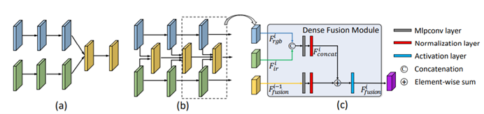
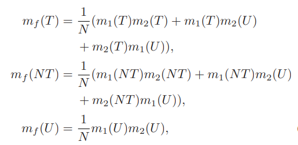
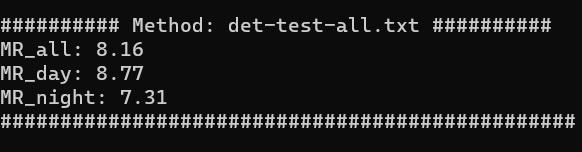

# CMPD-mindspore
This repository contains the code of "Confidence-aware Fusion using Dempster-Shafer Theory for Multispectral Pedestrian Detection" based on mindspore. Here we provide a demo and detailed instructions for constructing CMPD.

## Requirment
mindspore

Python 3

scikit-learn

numpy

scipy

## Demo
### 1. Feature-level Fusion


This module is used for multi-level fusion of dual branch resnet structure.

```
python .\demo_dfm.py
```

### 2. Decision-level Fusion


This module is used to perform evidence fusion on the output of each branch and evaluate the final result.

```
python .\demo_mcaf.py
```

Finally, you will obtain results that are consistent with our paper.



